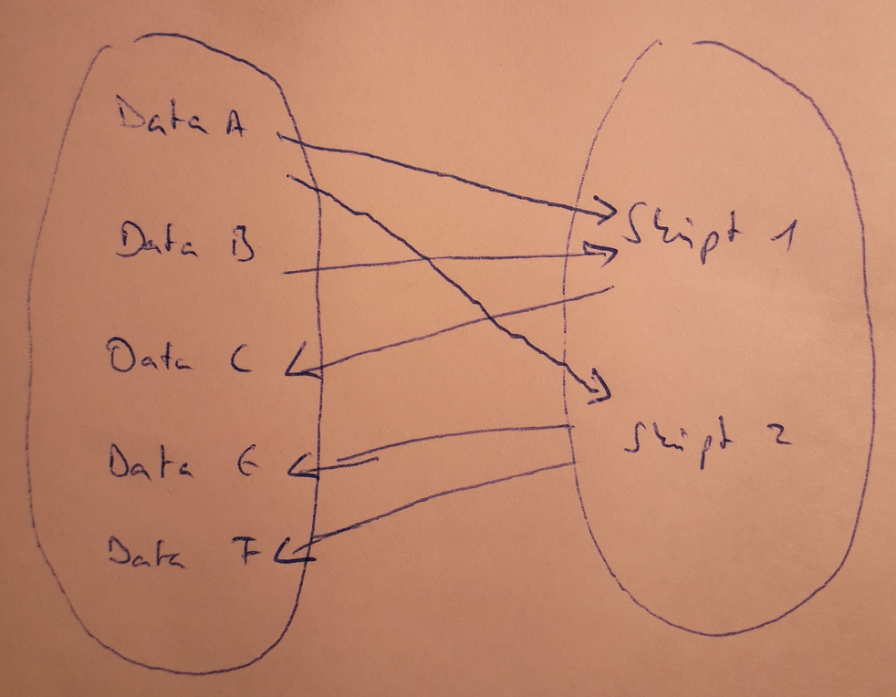

---
author:
- Guido Pleßmann
- Stephan Günther
title: Data Processing Pipeline
subtitle: Definition des Workflows und Datenaustausch mit OEDB \newline \footnotesize 2. Projekttreffen eGo^n^
institute: Reiner Lemoine Institut / Universtität Magdeburg
classoption: aspectratio=169
date: 26.05.2020
theme: egon
---

# Prämissen & Andorderungen

- Versionierung in der OEDB ist für Administration, nicht zum Produktiveinsatz gedacht
- Berechnungen des Data processings (DP) kann nicht auf OEP ausgeführt werden, lediglich zur Datenverwaltung
- Kommunikation mit der OEP nur über `oedialect`. Empfohlen: SQLAlchemy ORMs
- DP soll automatisiert reproduzierbar sein
- Einsatz von Open Source Tools
- Data processing ist auf beliegem Rechner ausführbar

# Data processing pipeline (production)

\center
{ width=68% }

# Versionierung & Workflow Management

- Versionierung erfolgt je Datensatz (Tabelle) mit eigenständiger Versionsnummer 
- Versionsnummer in einer Spalte der Tabelle -> mehere Versionen in einer Tabelle möglich
- Abhängigkeit zwischen Datensätzen (und dem zugehörigen Skript, was sie verknüpft) muss bekannt sein. Optionen
  - YAML, JSON, Python `dict()`
  
{ width=85% }

# Versionierung & Workflow Management

:::::: {.columns}
::: {.column  width=50%} 

- Abbildung der Abhängigkeiten und der Versionen mittels Graph (bipartit oder DAG)
- Verwaltung des Graphen je nach Workflow Management Tool
:::

::: {.column  width=50%}
{ width=100% }
:::
::::::

# Fragen zu Versionierung & Workflow Management

- Wie gehen wir mit Veränderungen der Tabellenstruktur (z.B. Spalte hinzufügen/umbenennen) um? Kann das im Rahmen einer neuen Version erfolgen?
- Können Bereiche gültiger Versionen definiert werden à la `>=0.3.2 <0.5.0`?
- Datenaustausch der Entwicklungsversion zwischen Projektpartner:innen (SQL Dumps, Schema _model_draft_, separater DB Server)?

# Spezifische Anforderungen DP development

- Datenaustausch von development Daten zwischen Projektpartnen (z.B. über Schema _model_draft_)
- Import von benötigten Daten zu Pipelineschritt X (z.B. SQL-Dump oder Funktion, die Abhängigkeiten auflöst)

# Spezifisches zur Pre-processing pipeline

Einige, der im pre-processing erstellten Tabellen, existieren bereits. Es muss beachtet werden

- nicht alle Daten müssen neu geschrieben werden
- Ersetzen einer Tabelle würde ggf. andere Menschen beeinflussen
- Änderungen der Tabellenstruktur (z.B. andere Spalten) bricht Workflows anderer Menschen (die wir nicht kennen)

# Benötigte Tools (helper functions)

- Import von Tabelle in lokale DB
- Constraints, Indizes, Metadaten (Comment), die in lokaler Datenbank erstellt werden, in OEP übernehmen
- Suche von Datensatz in versionierten Schemata, _model_draft_, in lokaler DB
- Metadaten.json Ersteller
- OEM2ORM
